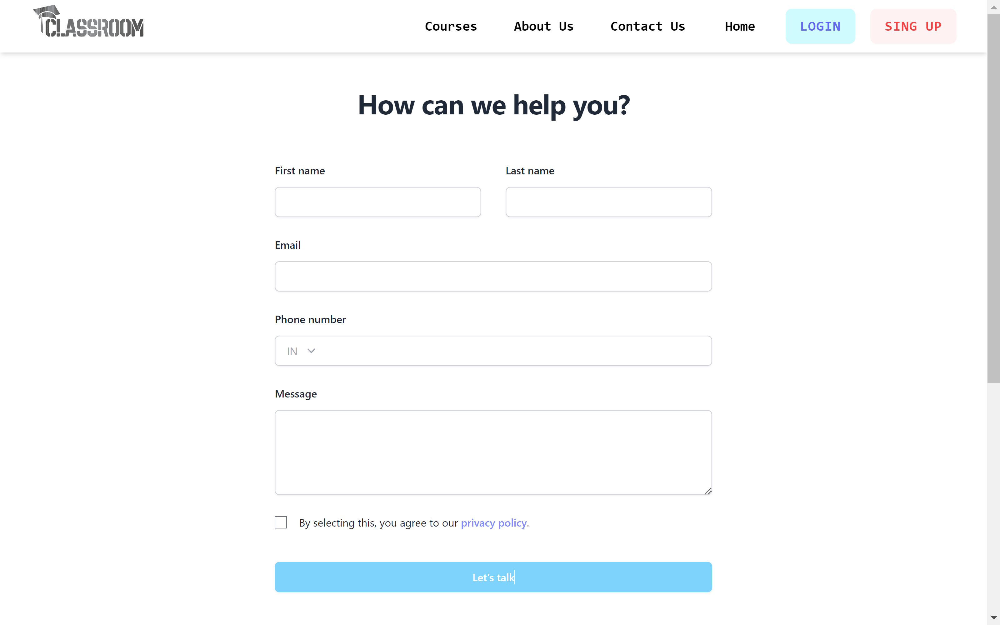

# Classroom (MERN Stack Project)

Classroom is a learning management system created by me with the collections of ideas gathered from many existing LMS, this allows user to purchase subscribtion through a payment gateway (test plan). User can create their profile, update profile, they can change password and even reset the password through a email if forgotten, they send contact email to the classroom. User can view course list and view lectures of any course after subscribtion

And Admin can create, update, and delete course. Admin can view registered users and subscriber count, Admin can view total revenue of the year, Admin can view, edit, and delete lectures, and also Admin can also update his/her profile.

### Visit the deployed site :

```
    https://classroom-react.netlify.app/
```

## Tech Stack

**Client:** React, Tailwind CSS, Redux

**Server:** Node, Express , MongoDB

## Features

**User**

    - Login/SignUp/Logout
    - subscribe through payment gateway (test plan)
    - Create and edit profile
    - View courses and lectures of courses (after subscribtion)
    - Change and reset password
    - Can fill Contact us form

**Admin**

      Along with all the capabilities of USER, Admin can also do,

    - Create/Update/Delete Course
    - View Subscriber and Registered users count
    - Add/Delete Lectures of any course
    - No Need to Subscribe to view the lectures

## Screenshots

- Home Page


- Login Page


- SignUp Page


- About Page


- Contact Page



- Course Landing Page


- Course Details Page


- Checkout Page


- PaymentGateway


- Payment Success Page


- Payment Failure


- Lectures Page


- Profile Page


- Forgot Password Page


## This Pages are Accessible by ADMIN Only

- Admin Dashboard Page


- Create Course Page


- ADD Lecture Page


## Installation Steps

 - ###  1. Clone the Project

    ````
        git clone https://github.com/Sohel-786/LMS.git
    ````

 - ###  2. There are two directories, Move into directory name `client`

    ````
        cd client
    ````

 - ### & Install dependencies

    ````
        npm i
    ````

 - ###  3. Move into directory name `server`

 - ### First

        ````
            cd ..
        ````
 - ### Second

        ````
            cd server
        ````
 - ### & Install dependencies

        ````
            npm i
        ````
  *  4. After Successful Installation of Dependencies for client and server both,
        start the client and server.

---

- **First clone the app in your local machine by running the below command in Git Bash.**

  - Run the Server

  ```
    npm run server
  ```

  - Run the Client, Move into Directory client first

  ```
    cd ..
  ```

  ```
    cd client
  ```

  ```
    npm run dev
  ```

- ## Note for Installation

You Should have your own credentials to run the project on your local machine, you should have `.env` file in the root of `client` folder and in the root of `server` folder also. I will provide structure below for both `.env` files. In that structure i will write what environment variable your `.env` file should have.

- ### .env file in client folder

    ````

    VITE_APP_BASE_URL = http://localhost:2346/api/v1

    ````

- ### .env file in server folder

    ````

    PORT = 2346
    MONGO_URI = Your MongoDB Connection string
    JWT_SECRET = Your JWT Secret 
    FRONTEND_URL = 'http://localhost:5173'
    JWT_EXPIRY = '72h'

    CLOUDINARY_CLOUD_NAME = Your Cloudinary Name - Your can get this credentials from cloudinary 
    CLOUDINARY_API_KEY = Your Cloudinary key - Your can get this credentials from cloudinary 
    CLOUDINARY_API_SECRET = Your Cloudinary Api Secret - Your can get this credentials from cloudinary 

    SMTP_HOST = 'smtp.gmail.com'
    SMTP_PORT = '465'

    SMTP_USERNAME = Your email address from which the emails will be sent to the users of this app (I used fake or temporary Email)

    SMTP_PASSWORD = In Google account of your fake email Enable the two step verification and then you can get this one time password

    SMTP_FROM_EMAIL = Your email address from which the emails will be sent to the users of this app (I used fake or temporary Email)

    RAZORPAY_KEY_ID = your razorpay key_id - Your can get this credentials from razorpay 
    RAZORPAY_SECRET =  your razorpay secret - Your can get this credentials from razorpay 
    RAZORPAY_PLAN_ID =  your razorpay plan_id - Your can get this credentials from razorpay (you have to create one plan for this)

    ````

## End Notes

This project is completely responsive. And you should visit the live link because there is much more then whatever you see in the screenshots.
